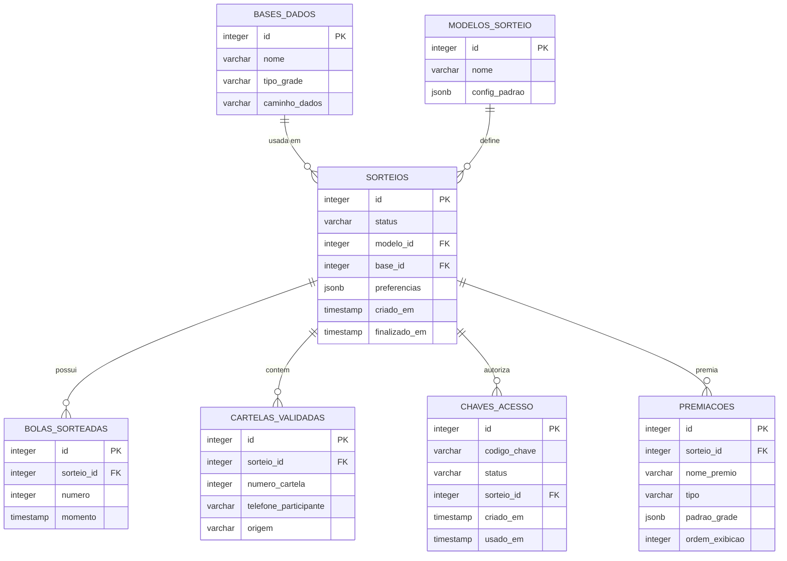

# Estrutura do Banco de Dados (Mermaid)

Aqui está a representação visual das tabelas e relacionamentos do banco de dados BingoSys:

## Descrição das Tabelas

- **SORTEIOS**: Tabela central que gerencia cada partida ou evento de bingo.
- **BASES_DADOS**: Armazena as configurações das bases de cartelas (caminho dos arquivos TXT e tipo de grade).
- **MODELOS_SORTEIO**: Modelos pré-configurados para novos sorteios.
- **BOLAS_SORTEADAS**: Histórico das bolas chamadas em cada sorteio específico.
- **CARTELAS_VALIDADAS**: Registro das cartelas vendidas/validadas para um sorteio.
- **CHAVES_ACESSO**: Chaves (Tokens) para login de operadores e participantes.
- **PREMIACOES**: Definição dos prêmios (Quinas, Formas, Bingo) vinculados a cada sorteio.
